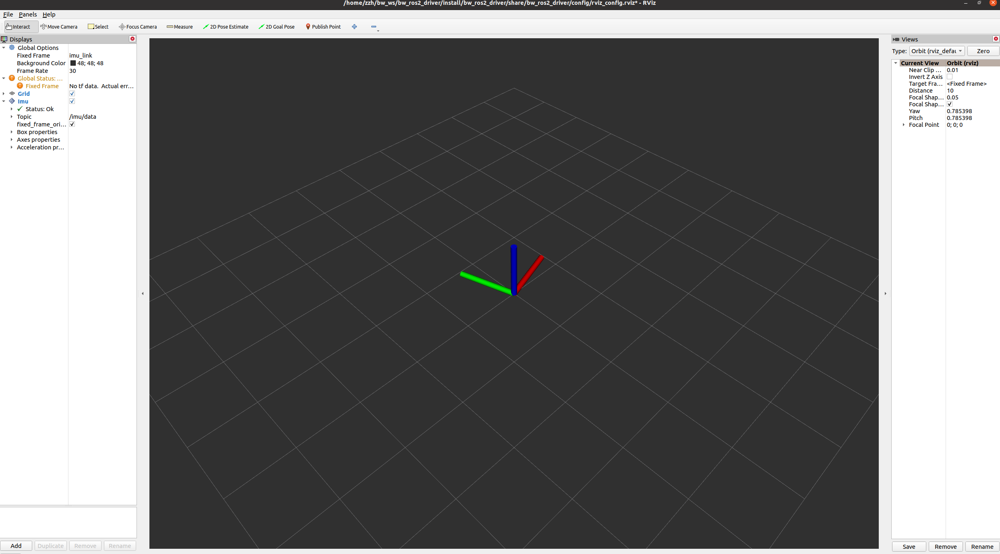

# 1. 简介

bw_ros2_driver 是一套用于北微传感产品的 ROS2 驱动程序，基于串口通信，实现以下功能：

- 读取 IMU 原始数据（姿态四元数 / 欧拉角、角速度、线加速度）

- 发布标准 ROS2 IMU 消息 sensor_msgs/Imu

- 发布磁场消息 sensor_msgs/MagneticField

- 目前已适配北微传感的常用协议
- 该驱动使用 ROS2 Foxy 开发，其他环境待测试
# 2. 软件依赖

请确保系统已安装：
- ROS2 Foxy（或兼容版本）
- colcon build 工具
- C++14 编译器
  
依赖 ROS2 包：
```
rclcpp
sensor_msgs
std_msgs
tf2
tf2_geometry_msgs
```
这些依赖已在 package.xml 和 CMakeLists.txt 中自动处理。

# 3. 编译

将本项目放入你的 ROS2 工作空间，例如：
```
~/ros2_ws/src/bw_ros2_driver
```

编译：
```
cd ~/ros2_ws
colcon build --packages-select bw_ros2_driver
```
编译完成后，加载环境：
```
source install/setup.bash
```
# 4. 启动
北微传感AHRS、MINS、VG系列产品的启动：
```
ros2 run bw_ros2_driver bw_node
```
北微传感DMC系列产品启动：
```
ros2 run bw_ros2_driver bw_node_dmc
```
带rviz的启动可以通过launch：
```
ros2 launch bw_ros2_driver bw_auto_launch.xml
#或者
ros2 launch bw_ros2_driver bw_dmc_launch.xml
```


# 5. 已发布的 ROS2 话题
| 话题名                | 消息类型                        | 描述                                 |
| --------------------- | ------------------------------- | ------------------------------------ |
| `/imu/data`（可配置） | `sensor_msgs/Imu`           | IMU 主数据（姿态、角速度、线加速度） |
| `/imu/mag`            | `sensor_msgs/MagneticField` | 三轴磁场数据                         |

你可以使用以下命令查看：
```
ros2 topic echo /imu/data

ros2 topic echo /imu/mag
```
# 6. 调试输出

如果 debug = true（默认开启），每秒会打印一次最近收到的数据帧。
