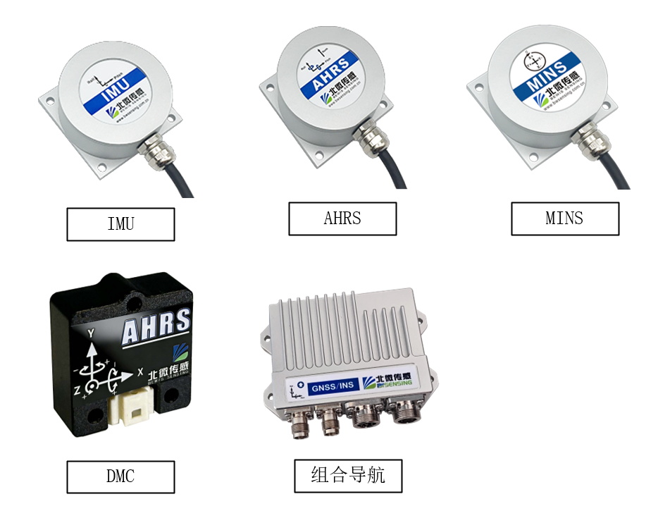

# bw_ros_driver (ROS 2 Humble)
北微ROS驱动仓库提供了北微产品的ROS驱动程序支持，目前支持ROS1,ROS2双版本，支持串口，CAN双接口，适配北微标准协议（77开头）与Nova协议（F3开头），仓库地址如下：

ROS1：https://github.com/zzh-0630/bw_ros_driver

ROS2：https://github.com/zzh-0630/bw_ros2_driver

！！！注意：
- 本仓库完全开源，可任意修改使用
- 本仓库持续开发优化中，不保证完全可靠，若有bug，可及时联系开发人员更新维护
- ROS官方已经停止了对ROS1的维护，后续开发维护会主要在ROS2基础上进行


## 1. 仓库简介与产品支持
北微传感器 ROS 2 驱动仓库，面向 **ROS 2 Humble**，支持多种设备协议与接入方式，包括：

- **串口标准协议**（帧头 `0x77`）
- **串口 Nova 协议**（帧头 `0xF3`）
- **GI320 INSPVA 导航数据协议**
- **SocketCAN IMU 数据接入**

本仓库的目标是将北微设备输出的数据统一封装为 ROS 2 消息，便于定位导航、姿态解算、机器人控制与上层算法集成。
本ROS驱动仓库是通配仓库，会对北微产品做全系列支持，目前已完成对IMU系列，MINS系列，AHRS系列，DMC系列，组合导航GI320的支持与测试。


## 2. 功能简介
当前仓库包含 4 个可执行节点：

| 节点名             | 接口类型  | 协议/数据源                      | 主要输出                                                     |
| ------------------ | --------- | -------------------------------- | ------------------------------------------------------------ |
| `bw_node_standard` | 串口      | 标准协议 `0x77`                  | `sensor_msgs/msg/Imu`、`sensor_msgs/msg/MagneticField`       |
| `bw_node_nova`     | 串口      | Nova 协议 `0xF3`                 | `sensor_msgs/msg/Imu`、`sensor_msgs/msg/MagneticField`       |
| `bw_node_gi320`    | 串口      | GI320 INSPVA 数据                | `bw_ros2_driver/msg/BewisInspva`、`sensor_msgs/msg/NavSatFix`、`geometry_msgs/msg/TwistStamped` |
| `bw_node_can`      | SocketCAN | 私有单 ID + payload mux IMU 数据 | `sensor_msgs/msg/Imu`                                        |

您可针对不同的产品启动相对应的ROS节点，读取对应的消息输出。

## 3. 环境要求

建议环境：

- Ubuntu 22.04
- ROS 2 Humble
- `colcon`
- Linux 串口设备访问权限
- SocketCAN（仅 CAN 模式需要）

## 4. 编译方法

### 4.1 创建工作空间

```bash
mkdir -p ~/ros2_ws/src
cd ~/ros2_ws/src
```

将本仓库放入 `src` 目录，例如：

```bash
cd ~/ros2_ws/src
git clone https://github.com/zzh-0630/bw_ros2_driver.git
```

### 4.2 编译

```bash
cd ~/ros2_ws
source /opt/ros/humble/setup.bash
colcon build --symlink-install --packages-select bw_ros2_driver
source install/setup.bash
```

## 5. 启动方式
### 5.1 标准协议串口节点

适用于输出 **`0x77` 标准协议** 的设备。

启动前建议先确认串口存在：

```bash
ls -l /dev/ttyUSB*
```

必要时赋权：

```bash
sudo chmod a+rw /dev/ttyUSB0
```

启动命令：

```bash
ros2 launch bw_ros2_driver bw_ros_standard.launch.py
```

---

### 5.2 Nova 协议串口节点

适用于输出 **`0xF3` Nova 协议** 的设备。

启动命令：

```bash
ros2 launch bw_ros2_driver bw_ros_nova.launch.py
```

---

### 5.3 GI320 导航节点

针对北微产品GI320做的单独适配，输出 **INSPVA 导航数据** 。

启动命令：

```bash
ros2 launch bw_ros2_driver bw_ros_gi320.launch.py
```

---

### 5.4 CAN 节点

适用于通过 **SocketCAN** 接收 IMU 数据的设备。

先配置 CAN 网口：

```bash
sudo ip link set can0 down || true
sudo ip link set can0 up type can bitrate 250000
ip -details link show can0
```

启动命令：

```bash
ros2 launch bw_ros2_driver bw_ros_can.launch.py
```